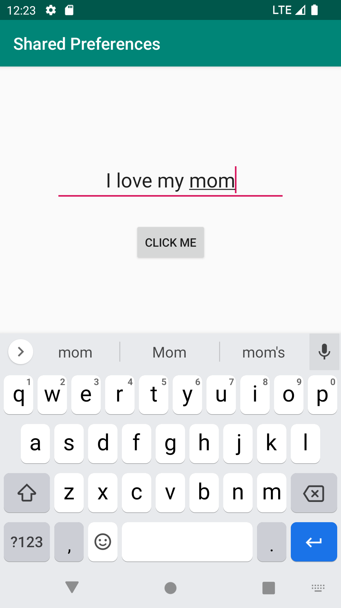

# Rapport

**Assignment 6: Shared Preferences**

The goal here is to pass data from one activity and have the data displayed in another activity using SharedPreferences.

To meet this goal, a new activity has to be created. For this project, the activity will simply be called Second activity.
Both Main and Second activity are styled with required views in their corresponding layout xml files, that is:

(in Main)
- a text view for outputting (displaying data)
- a button to launch Second activity

Result: 

(in Second activity)
- an edit view to type something that is to be saved
- a button to store the input in the edit view then finish the activity.

Result:  

These elements are then also declared in their corresponding java classes.

A string with the value "keyData" is put in Strings.xml to use as a key for the data that will be stored and retrieved later.

In MainActivity.java, a method change() is created to launch Second activity on a buttonclick using onSetListener and onClick method.

In SecondActivity.java, a method called store() is created. The purpose of this method is to save the input in the edit view as a string and store it in the shared file between activities.

See code below:
```
private final String key = String.valueOf(R.string.keyData);

store() {
    EditText input = findViewById(R.id.et_input);
    String data = input.getText().toString();
    SharedPreferences.Editor sharedPrefDataEditor = sharedPreferences.edit();
    sharedPrefDataEditor.putString(key, data);
    sharedPrefDataEditor.apply();
}
```

Back in the MainActivity class, an override on the method onResume() is used to display the stored data immediately on return to the activity.
See code below:

```
private final String key = String.valueOf(R.string.keyData);

@Override
    protected void onResume() {
        super.onResume();
        Log.d("a21liltr", "Main activity resumed");
        String defaultValue = "Nothing has been shared.";
        SharedPreferences sharedPref = getSharedPreferences(key, MODE_PRIVATE);
        sharedOutput.setText(sharedPref.getString(key, defaultValue));
    }
```

The result after making an input in Second activity, clicking the button and returning to Main activity is shown below:


The app will only display the _latest_ input made in Second activity.